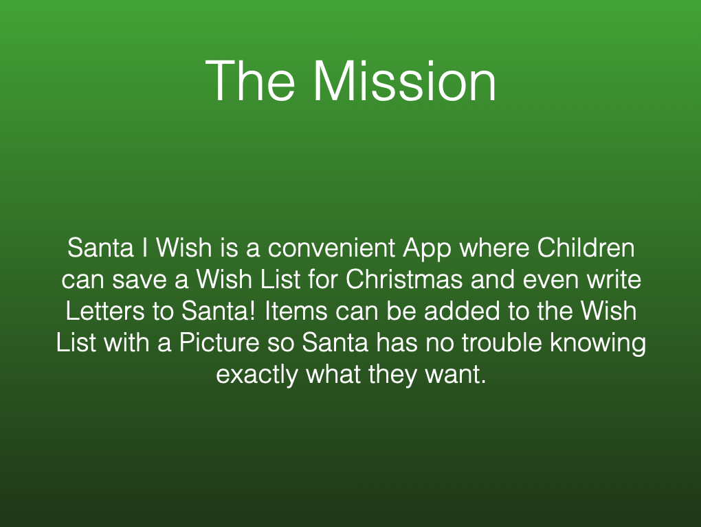
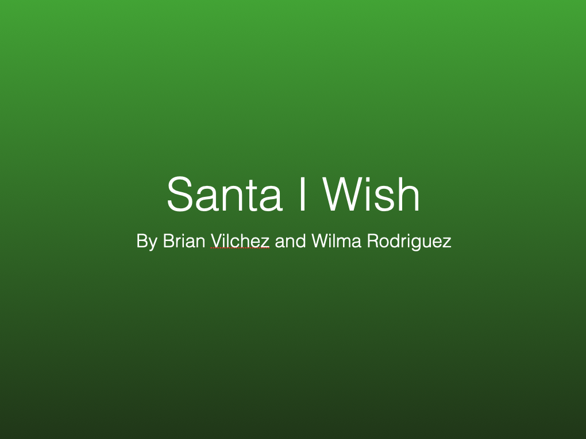
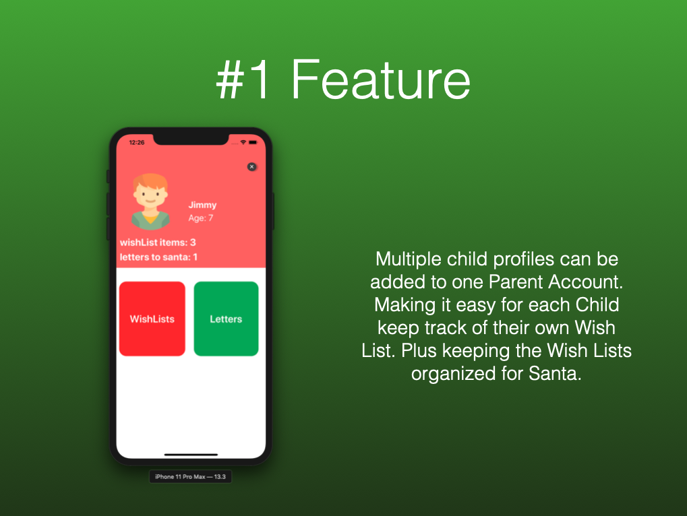
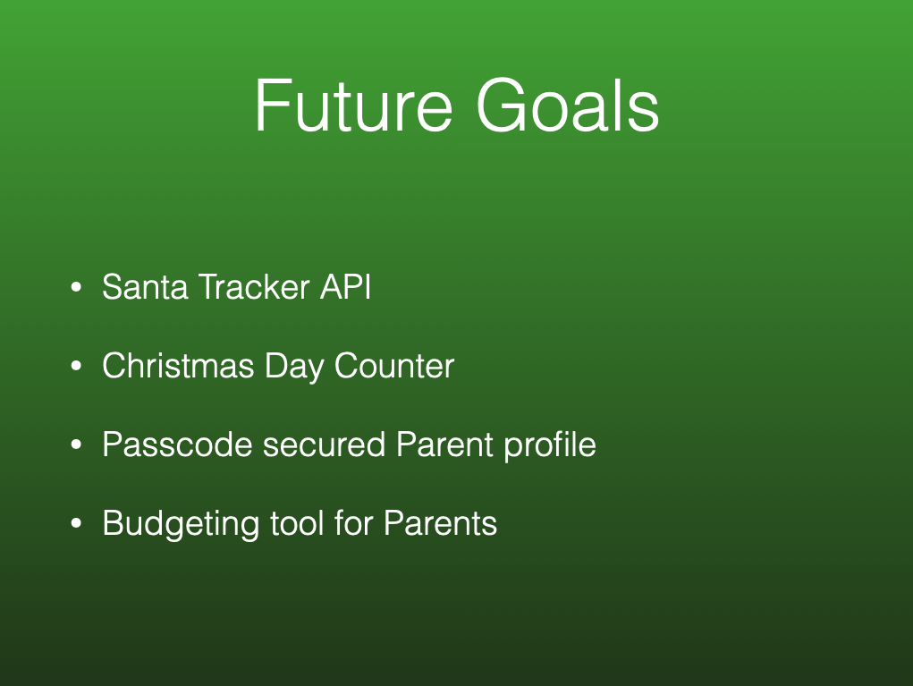

# Project Proposal for iOS Build Sprint

1. Fork and Clone this repository
2. Fill out the information below (Remove `<placeholders>` and add your answers)
3. Tag your TL and Instructor on your Pull Request

## Plan

1. Create a Slack DM Group with your partner, TL, and Instructor and say "hi!"

1. BrainstormingAdd photos, notes, and sketches from your brain storming session. 

## Requirements

### 1. Team Members: 
* Brian Vilchez 
* Wilmari Rodriguez

### 2. App Name: 

Santa I Wish

### 3. App Description:    
A child frieandly app where children can make they're Christmas Wish List. Parents can setup child's account and later see what they're child's Christmas list looks like. Kids can write down what they want for Christmas or take pictures of toys they like and add it to the list for Santa to see. 

### 4. Your #1 Customer (Who would use your app? Why now?)    

Both Wilmari and her 5 year old daughter, Raelyn. 
Raelyn can take pictures or screenshots of they gifts she wants for Christmas, creating her Wish List. Mom can login in the parent section to see the Wish list.

### 5. Github Project/Trello Board:
https://trello.com/b/rAne2sdK/bw-unit4-santa-i-wish

## Keynotes

<!-- Other option  -->

