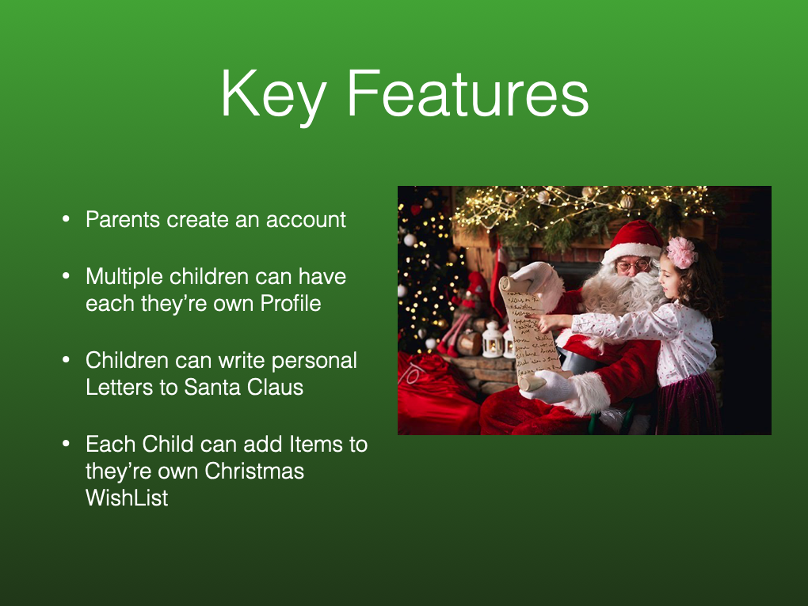

# Santa I Wish 
Child friendly app where children can create they're Christmas Wish List. Parents can set up a child's account and later see what they're child's Christmas list looks like. Kids can write down what they wish for Christmas or take pictures of toys they like and add them to the list for Santa to see. 

## Demo

[[Santa I Wish Demo]](videos/IMG_1918.MP4)

## Keynotes

<!-- Other option  -->

### Github Project/Trello Board:
https://trello.com/b/rAne2sdK/bw-unit4-santa-i-wish